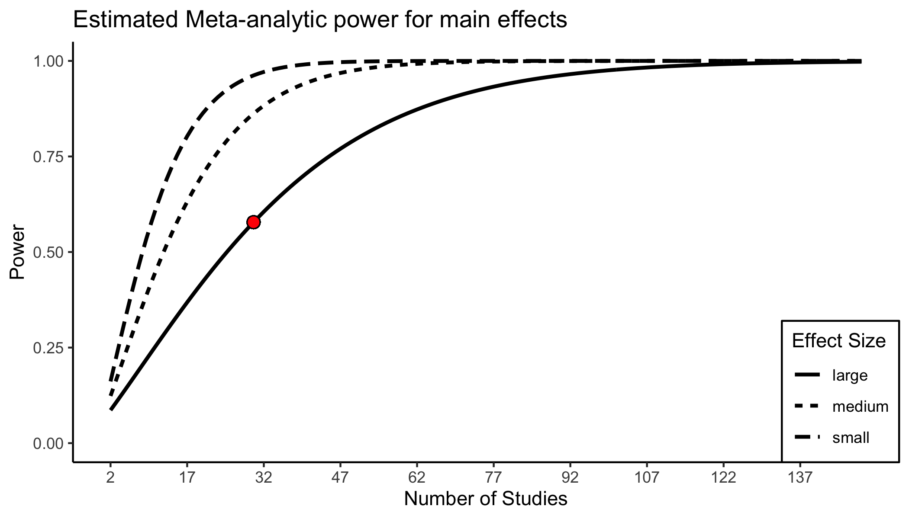

<!-- README.md is generated from README.Rmd. Please edit that file -->

# metapower 

<!-- badges: start -->

<!-- badges: end -->

The primary goal of metapower is to compute statistical power for
meta-analyses. Currently, metapower is designed to compute statistical
power for the following under fixed- and random-effects models:

1.  Mean effect size difference between groups (e.g., Cohen’s *d*)
2.  Test of homogenity for between-study variance
3.  Categorical moderator analyses of the mean effect size

## Installation

You can install the released version of metapower from
[CRAN](https://CRAN.R-project.org) with:

``` r
install.packages("metapower")
```

And the development version from [GitHub](https://github.com/) with:

``` r
# install.packages("devtools")
devtools::install_github("jasonwgriffin/metapower")
```

# Example 1: Computing power to detect mean difference effect size

Suppose that we plan to meta-analyze all published findings to compute a
summary effect size estimate for the group difference between typically
developing individuals and indivudals with autism on a measure of face
reocognition ability. In order to plan the study accordingly, we must
choose plausible values for the following:

1.  Expected effect size
2.  Expected sample size per group
3.  Expected number of studies
4.  Expected degree of heterogenity (only for Random-effects model)

…*for our meta-analysis of face recognition deficits in autism*

1.  We expect that face recognition deficits in ASD are small (Cohen’s d
    = 0.25)
2.  Sample sizes in autism research are generally small. We expect the
    average group size to be 20.
3.  Face recognition is frequently studied in autism; therefore, we
    expect to find 50 studies.
4.  Autism is notoriously heterogenous. We expect large heterogenity
    between-studies.

To do this with `metapower`, we use the core function `mpower()`

``` r
library(metapower)
my_power <- mpower(effect_size = .25, 
                   sample_size = 20, 
                   k = 50, 
                   hg = "large", 
                   es_type = "d",
                   model = "random", 
                   test_type = "two-tailed")
```

Note that we specify this a random-effects model (`model = "random`).
For fixed-effects model, use `model = "fixed"`.

``` r
print(my_power)
#> 
#>  Estimated Power Analysis for: RANDOM-effects Model 
#> 
#>  Expected Effect Size:                     0.25 
#>  Expected Sample Size:                     20 
#>  Expected Number of Studies;               50 
#>  Expected heterogenity (tau^2):            large 
#>  Expected between-study sd:                NA 
#> 
#>  Estimated Power:                          0.7951118 
#>  Estimated Power for Test of Homogeneity:  NA
```

The first part of the output shows the expected input values, where the
main results are shown in the bottom portion, mainly, `Estimated Power`.
Under this set of values, our power to detect a mean difference is
79.51%. To visualize the power curve for these set of input parameters,
use `power_plot()` to generate a `ggobject` that is fully customizable
and by default, shows 10x as many studies as the user inputs.

``` r
power_plot(my_power)
```



# Example 2: Power for a test of homogeneity

In addition to estimating a main effect, researchers are often
interested in testing the homogenity of variance, which for
fixed-effects models is ‘common variance’ for each study, whereas for
random-effects models, this is the amount of variation between studies.
In keeping with our face recognition example, we only need to specify
the aditional arguement `sd =`:

``` r
homogen_power <- mpower(effect_size = .25, 
                   sd = .5,
                   sample_size = 20, 
                   k = 50, 
                   hg = "large", 
                   es_type = "d",
                   model = "random", 
                   test_type = "two-tailed")
```

``` r
print(homogen_power)
#> 
#>  Estimated Power Analysis for: RANDOM-effects Model 
#> 
#>  Expected Effect Size:                     0.25 
#>  Expected Sample Size:                     20 
#>  Expected Number of Studies;               50 
#>  Expected heterogenity (tau^2):            large 
#>  Expected between-study sd:                0.5 
#> 
#>  Estimated Power:                          0.7951118 
#>  Estimated Power for Test of Homogeneity:  1
```
