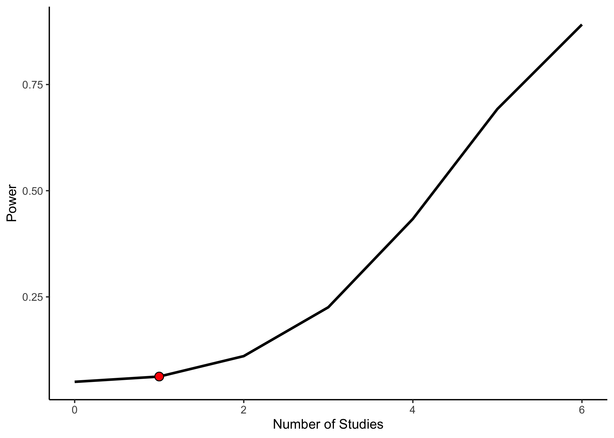

<!-- README.md is generated from README.Rmd. Please edit that file -->
metapower 
=============================================================================

<!-- badges: start -->
<!-- badges: end -->
The primary goal of metapower is to compute statistical power for meta-analyses. Currently, metapower is designed to compute statistical power for the following under fixed- and random-effects models:

1.  Mean effect size difference between groups (e.g., Cohen's *d*)
2.  Test of homogeneity for between-study variance
3.  Categorical moderator analyses of the mean effect size

All mathematical calculations are derived from L. V. Hedges & Pigott (2004), Bornstein, Hedges, Higgins, & Rothstein (2009), and T. D. Pigott (2012).

Installation
------------

You can install the released version of metapower from [CRAN](https://CRAN.R-project.org) with:

``` r
install.packages("metapower")
```

And the development version from [GitHub](https://github.com/) with:

``` r
# install.packages("devtools")
devtools::install_github("jasonwgriffin/metapower")
```

Example 1: Computing power to detect mean difference effect size
================================================================

Suppose that we plan to meta-analyze all published findings to compute a summary effect size estimate for the group difference between typically developing individuals and individuals with autism on a measure of face recognition ability. In order to plan the study accordingly, we must choose plausible values for the following:

1.  Expected effect size
2.  Expected sample size per group
3.  Expected number of studies
4.  Expected degree of heterogeneity (only for Random-effects model)

...*for our meta-analysis of face recognition deficits in autism*

1.  We expect that face recognition deficits in ASD are small (Cohen's d = 0.25)
2.  Sample sizes in autism research are generally small. We expect the average group size to be 20.
3.  Face recognition is frequently studied in autism; therefore, we expect to find 50 studies.
4.  Autism is notoriously heterogeneous. We expect large heterogeneity between-studies.

To do this with `metapower`, we use the core function `mpower()`

``` r
library(metapower)
my_power <- mpower(effect_size = .25, 
                   sample_size = 20, 
                   k = 30, 
                   hg = "large", 
                   es_type = "d",
                   model = "random")
```

Note that we specify this a random-effects model (`model = "random`). For fixed-effects model, use `model = "fixed"`.

``` r
print(my_power)
#> 
#>  Estimated Power Analysis for: RANDOM-effects Model 
#> 
#>  Expected Effect Size:                     0.25 
#>  Expected Sample Size:                     20 
#>  Expected Number of Studies;               30 
#>  Expected heterogenity (tau^2):            large 
#>  Estimated Power:                          0.57799 
#>  Estimated Power for Test of Homogeneity:  1
```

The first part of the output shows the expected input values, where the main results are shown in the bottom portion, mainly, `Estimated Power`. Under this set of values, our power to detect a mean difference is 57.8%. Furthermore, we can look at the power to detect heterogeneity among included studies by examining the `Estimated Power for Test of Homogeneity` output, which for this set of values is 100%

To visualize the power curve for these set of input parameters, use `power_plot()` to generate a `ggobject` that is modifiable and by default, shows 10x as many studies as the user inputs.

``` r
power_plot(my_power)
```


For users wanting more flexibility in visualization, the `mpower` object contains a dataframe `$df` containing all data populating the `ggobject`,

``` r
str(my_power$df)
#> Classes 'tbl_df', 'tbl' and 'data.frame':    444 obs. of  5 variables:
#>  $ es_v        : num  0.25 0.25 0.25 0.25 0.25 0.25 0.25 0.25 0.25 0.25 ...
#>  $ n_v         : num  20 20 20 20 20 20 20 20 20 20 ...
#>  $ k_v         : int  2 3 4 5 6 7 8 9 10 11 ...
#>  $ Heterogenity: chr  "small" "small" "small" "small" ...
#>  $ power       : num  0.161 0.219 0.276 0.332 0.386 ...
```

We can also visual the power curve for testing heterogeneity among studies using `homogen_power_plot()` around our `mpower` object.

``` r
homogen_power_plot(my_power)
```



Example 2: Power analysis moderation analysis (categorical variables)
---------------------------------------------------------------------

Although researchers are primarily interested in conducting meta-analysis to quantify the main effect of a specific phenomenon, It is very common to evaluate the moderation of this overall effect based on a number of study- and/or sample-related characteristics such as task paradigm or age group (e.g., children, adolescents, adults). To compute the statistical power for the detection of categorical moderators, we use the function `mod_power()` with a few additional arguments, mainly:

1.  Expected number of groups:
2.  Expected effect size of each group:
3.  Expected standard deviation within each group:

``` r
my_moderation <- mod_power(n_groups = 3, 
                       effect_sizes = c(.1,.2,.6), 
                       sample_size = 15, 
                       k = 15,
                       model = "fixed", 
                       hg = "small",
                       es_type = "Correlation",
                       sd_within = c(1,1,4), 
                       test_type = "one-tailed",
                       p = .05)
```

``` r
print(my_moderation)
#> 
#>  Estimated Power for Categorical Moderators: FIXED-effects Model 
#> 
#>  Number of groups:                              3 
#>  Expected Effect Sizes:                         0.1 0.2 0.6 
#>  Expected Sample Size(per group):               15 
#>  Expected Number of Studies;                    15 
#>  Expected heterogenity(t^2):                    NA 
#> 
#>  Estimated Power for between-group moderation:  0.8260749 
#>  Estimated Power for within-group moderation:   0.825013
```

Given, this set of expected values, we have 82.61% to detect between-group differences and 82.5% to detect within-group differences.

References
----------

Bornstein, M., Hedges, L. V., Higgins, J., & Rothstein, H. (2009). *Introduction to meta-analysis*. Hoboken, NJ: Wiley.

Hedges, L. V., & Pigott, T. D. (2004). The power of statistical tests for moderators in meta-analysis. *Psychological Methods*, *9*(4), 426–445. <https://doi.org/10.1037/1082-989x.9.4.426>

Pigott, T. D. (2012). *Advances in meta-analysis*. NewYork, NY: Springer.

Issues
------

If you encounter a clear bug, please file a minimal reproducible example on [github](https://github.com/jasonwgriffin/metapower/issues).
