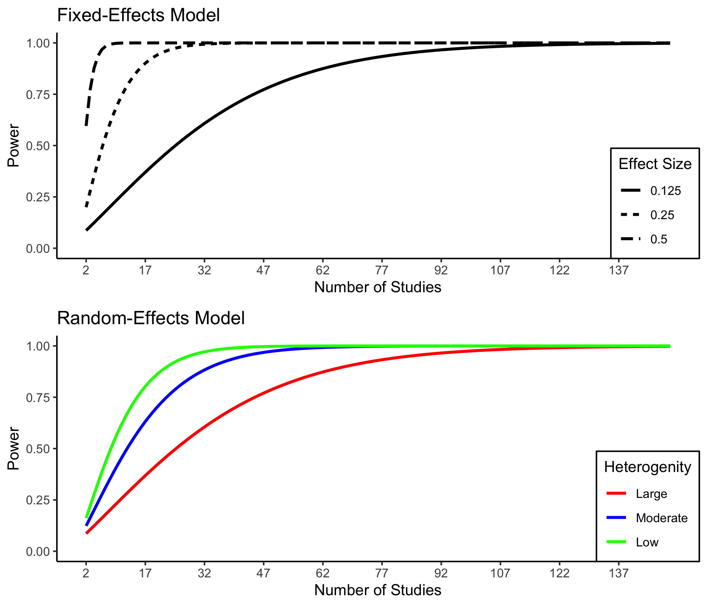

<!-- README.md is generated from README.Rmd. Please edit that file -->
metapoweR 
=============================================================================

<!-- badges: start -->
<!-- badges: end -->
The primary goal of metapower is to compute statistical power for meta-analyses. Currently, metapower has the following functionality:

Computation of statistical power for:

1.  Summary main effects sizes
2.  Test of homogeneity for between-study variance (for Random-effects models).
3.  Test of homogenity for within-study variance
4.  Categorical moderator analyses

metapower can currently handle the following designs and effect sizes:

1.  Standardized mean difference: Cohen's *d*
2.  Correlation betwen two continous variables: Correlatiion Coefficient (via Fisher's r-to-z transformation)
3.  Probability of Success/Faluire: Odds Ratio

Visualization of power curves for

1.  Main effects
2.  Between-study variance (for Random-effects models)

Installation
------------

And the development version from [GitHub](https://github.com/) with:

``` r
# install.packages("devtools")
devtools::install_github("jasonwgriffin/metapower")
```

Example 1: Computing power to detect mean difference effect size
----------------------------------------------------------------

Suppose that we plan to meta-analyze all published findings to compute a summary effect size estimate for the group difference between typically developing individuals and individuals with autism on a measure of face recognition ability. In order to plan the study accordingly, we must choose plausible values for the following:

1.  Expected effect size
2.  Expected sample size per group
3.  Expected number of studies
4.  Expected degree of heterogeneity (only for Random-effects model)

...*for our meta-analysis of face recognition deficits in autism*

1.  We expect that face recognition deficits in ASD are small (Cohen's d = 0.25)
2.  Sample sizes in autism research are generally small. We expect the average group size to be 20.
3.  Face recognition is frequently studied in autism; therefore, we expect to find 50 studies.
4.  Autism is notoriously heterogeneous. We expect large heterogeneity between-studies.

To do this with `metapower`, we use the core function `mpower()`

``` r
library(metapower)
my_power <- mpower(effect_size = .25, 
                   sample_size = 20, 
                   k = 30, 
                   hg = "large", 
                   es_type = "d",
                   model = "random")
```

Note that we specify this a random-effects model (`model = "random`). For fixed-effects model, use `model = "fixed"`.

``` r
print(my_power)
#> 
#>  Estimated Power Analysis for: RANDOM-effects Model 
#> 
#>  Expected Effect Size:                     0.25 
#>  Expected Sample Size:                     20 
#>  Expected Number of Studies;               30 
#>  Expected heterogenity (tau^2):            large 
#> 
#>  Estimated Power:                          0.57799 
#>  Estimated Power for Test of Homogeneity:  1
```

The first part of the output shows the expected input values, where the main results are shown in the bottom portion, mainly, `Estimated Power`. Under this set of values, our power to detect a mean difference is 57.8%. Furthermore, we can look at the power to detect heterogeneity among included studies by examining the `Estimated Power for Test of Homogeneity` output, which for this set of values is 100%

To visualize the power curve for these set of input parameters, use `power_plot()` to generate a `ggobject` that is modifiable and by default, shows 10x as many studies as the user inputs.

``` r
power_plot(my_power)
```



For users wanting more flexibility in visualization, the `mpower` object contains a dataframe `$df` containing all data populating the `ggobject`,

``` r
str(my_power$df)
#> Classes 'tbl_df', 'tbl' and 'data.frame':    447 obs. of  6 variables:
#>  $ k_v         : int  2 3 4 5 6 7 8 9 10 11 ...
#>  $ es_v        : num  0.25 0.25 0.25 0.25 0.25 0.25 0.25 0.25 0.25 0.25 ...
#>  $ n_v         : num  20 20 20 20 20 20 20 20 20 20 ...
#>  $ Heterogenity: chr  "small" "small" "small" "small" ...
#>  $ variance    : num  0.101 0.101 0.101 0.101 0.101 ...
#>  $ power       : num  0.161 0.219 0.276 0.332 0.386 ...
```

Example 2: Power analysis for moderation analysis (categorical variables)
-------------------------------------------------------------------------

Although researchers are primarily interested in conducting meta-analysis to quantify the main effect of a specific phenomenon, It is very common to evaluate the moderation of this overall effect based on a number of study- and/or sample-related characteristics such as task paradigm or age group (e.g., children, adolescents, adults). To compute the statistical power for the detection of categorical moderators, we use the function `mod_power()` with a few additional arguments, mainly:

1.  Expected number of groups (`n_groups`):
2.  Expected effect size of each group(`effect_sizes`):

...*for our meta-analysis of face recognition deficits in autism*

We may expect that face recognition tasks have larger effect sizes then face perception tasks; therefore, we specify 2 groups and their respective expected effect sizes:

1.  `n_groups = 2`
2.  `effect_sizes = c(.2,.5)`

``` r
my_mod <- mod_power(n_groups = 4, 
                           effect_sizes = c(1,4,5,6), 
                           es_type = "d",
                           sample_size = 20,
                           k = 20,
                           hg = "large",
                           model = "random")
```

``` r
print(my_mod)
#> 
#>  Estimated Power for Categorical Moderators: RANDOM-effects Model 
#> 
#>  Number of groups:                              4 
#>  Expected Effect Sizes:                         1 4 5 6 
#>  Expected Sample Size(per group):               20 
#>  Expected Number of Studies;                    20 
#>  Expected heterogenity(t^2):                    large 
#> 
#>  Estimated Power for between-group moderation:  0.2132226 
#>  Estimated Power for within-group moderation:   NA
```

Given, this set of expected values, we have 21.32% to detect between-group differences between face perception and face recognition deficits in ASD based on these set of expectations. As expected, moderator effects are much harder to detect and more studies are required, especially when heterogenity is high.

References
----------

All mathematical calculations are derived from L. V. Hedges & Pigott (2004), Bornstein, Hedges, Higgins, & Rothstein (2009), and T. D. Pigott (2012).

Bornstein, M., Hedges, L. V., Higgins, J., & Rothstein, H. (2009). *Introduction to meta-analysis*. Hoboken, NJ: Wiley.

Hedges, L. V., & Pigott, T. D. (2004). The power of statistical tests for moderators in meta-analysis. *Psychological Methods*, *9*(4), 426–445. <https://doi.org/10.1037/1082-989x.9.4.426>

Pigott, T. D. (2012). *Advances in meta-analysis*. NewYork, NY: Springer.

Issues
------

If you encounter a clear bug, please file a minimal reproducible example on [github](https://github.com/jasonwgriffin/metapower/issues).
