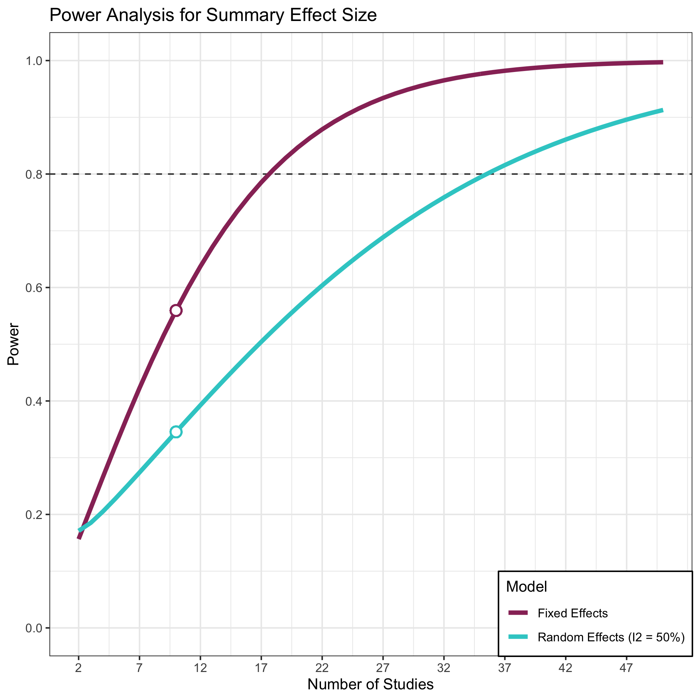

<!-- README.md is generated from README.Rmd. Please edit that file -->

# metapoweR 

<!-- badges: start -->

[](https://CRAN.R-project.org/package=metapower)
[](https://www.tidyverse.org/lifecycle/#stable)

<!-- badges: end -->

The primary goal of metapower is to compute statistical power for
meta-analyses. Currently, metapower has the following functionality:

Computation of statistical power for:

1.  Summary main effects sizes
2.  Test of homogeneity for between-group variance (for Random-effects
    models).
3.  Test of homogeneity for within-study variance
4.  Categorical moderator analyses

metapower can currently handle the following designs and effect sizes:

4.  Standardized mean difference: Cohen’s *d*
5.  Correlation between two continuous variables: Correlation
    Coefficient (via Fisher’s r-to-z transformation)
6.  Probability of Success/Failure: Odds Ratio

## Installation

And the development version from [GitHub](https://github.com/) with:

``` r
# install.packages("devtools")
devtools::install_github("jasonwgriffin/metapower")
```

## Example

``` r
library(metapower)
my_power <- mpower(effect_size = .25, sample_size = 20, k = 30, es_type = "d")
print(my_power)
#> 
#>  Estimated Meta-Analytic Power 
#> 
#>  Expected Effect Size:              0.25 
#>  Expected Sample Size (per group):  20 
#>  Expected Number of Studies;        30 
#>  Expected between-study sd:         
#> 
#>  Estimated Power: Main effect 
#> 
#>  Fixed-Effects Model                             0.990698 
#>  Random-Effects Model (Low Heterogenity):        0.962092 
#>  Random-Effects Model (Moderate Heterogeneity):  0.8621495 
#>  Random-Effects Model (Large Heterogeneity):     0.57799 
#> 
#>  Estimated Power: Test of Homogenity 
#> 
#>  Fixed-Efects Model                              NA 
#>  Random-Effects Model (Low Heterogeneity):       0.2926194 
#>  Random-Effects Model (Moderate Heterogeneity):  0.9782353 
#>  Random-Effects Model (Large Heterogeneity):     1
power_plot(my_power)
```



See Vignette “Using metapower” for more information

## References

All mathematical calculations are derived from Hedges & Pigott (2004),
Bornstein, Hedges, Higgins, & Rothstein (2009), and Pigott (2012).

<div id="refs">

<div id="ref-bornstein2009">

Bornstein, M., Hedges, L. V., Higgins, J., & Rothstein, H. (2009).
*Introduction to meta-analysis*. Hoboken, NJ: Wiley.

</div>

<div id="ref-hedges2004">

Hedges, L. V., & Pigott, T. D. (2004). The power of statistical tests
for moderators in meta-analysis. *Psychological Methods*, *9*(4),
426–445. <https://doi.org/10.1037/1082-989x.9.4.426>

</div>

<div id="ref-pigott2012">

Pigott, T. D. (2012). *Advances in meta-analysis*. NewYork, NY:
Springer.

</div>

</div>

## Issues

If you encounter a clear bug, please file a minimal reproducible example
on [github](https://github.com/jasonwgriffin/metapower/issues).
